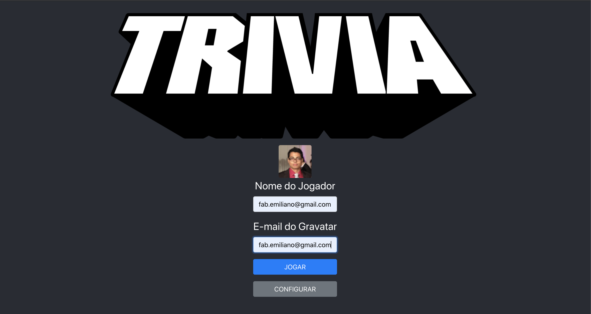

# Trivia Game

This application is part of the projects devoloped for the Trybe Course along with another two other colleagues.

It is the first project that I have used Redux as a state controller.

[Trivia API](https://opentdb.com/api_config.php) was the source for the questions in the game. 

For the avatars, requests are made to [Gravatar](https://en.gravatar.com/). It is necessary to have a profile with a picture to show the player's avatar.

The game can be configured with categories, level and type of the questions.

A 30s timer is show for every question and the final score is calculated based on the question level and the remaining time.

In the end of the game a rank can be shown ordered by highest scores.

A deployed version of the project can be found on: www.fabemiliano.github.io/trivia-game

